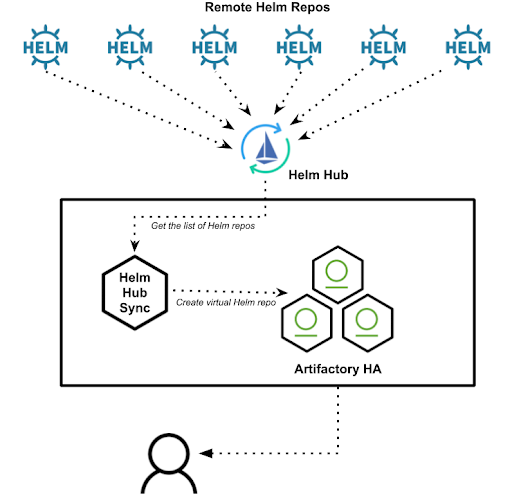

# helm-hub-sync

[](https://goreportcard.com/report/github.com/jfrog/helm-hub-sync)
[](http://godoc.org/github.com/jfrog/helm-hub-sync)
[](https://github.com/jfrog/helm-hub-sync/releases/latest)


A command line tool to synchronize [Helm Hub](https://github.com/helm/hub) repositories with [JFrog Artifactory](https://jfrog.com/artifactory/)

## Why do I need this

That's a really good question to begin with! [Helm Hub](https://hub.helm.sh) with the new UI is super awesome, but it only can be used as distributed public repository to search for charts in UI.
You might still want to have a single central location where you can find the Helm charts for your organization. `helm-hub-sync` helps you maintain a virtual repository in Artifactory that can be that single source of truth, using the configuration from Helm Hub.



## Environment variables

To run the app, you'll need to set a few command line variables

* **TIMEINTERVAL**: The time in seconds between two successive runs (if not set, or set to `-1`, only one run will be done)
* **LOGLEVEL**: The log level to use (possible values are `panic`, `fatal`, `error`, `warn`, `info`, and `debug`)
* **CONSOLELOG**: Boolean value to create human-friendly, colorized output (set to `true` for console logging)
* **ARTIFACTORY_HOST**: The hostname of JFrog Artifactory to connect to (like `http://jfrog.local/artifactory`)
* **ARTIFACTORY_HELM_REPO**: The Helm Virtual Repository to use (like `helm`)
* **ARTIFACTORY_AUTH_TYPE**: The authentication type to use (either `basic` or `apikey`)
* **ARTIFACTORY_AUTH_DATA**: The authentication data to use (see below for details)
* **ARTIFACTORY_KEEP_LIST**: A comma separated list containing Helm Remote repos that will never be removed (like `myAwesomeRepo, stable`)
* **ARTIFACTORY_KEEP_DELETED_REPOS**: Boolean value whether to keep repos that have been removed from the GitHub data (defaults to `false`)
* **GITHUB_IGNORE_LIST**: A comma separated list containing Helm repos that should never be created (like `stable, another-repo`)

## Authentication

**helm-hub-sync** uses JFrog Artifactory's REST API to update the Helm repositories. The JFrog Artifactory REST API supports a few forms of authentication:

* Basic authentication using your username and password
  * Set `ARTIFACTORY_AUTH_TYPE` to `basic` and `ARTIFACTORY_AUTH_DATA` to `<username>:<password>`
* Basic authentication using your username and API Key.
  * Set `ARTIFACTORY_AUTH_TYPE` to `basic` and `ARTIFACTORY_AUTH_DATA` to `<username>:<apikey>`
* Using an access token instead of a password for basic authentication.
  * Set `ARTIFACTORY_AUTH_TYPE` to `basic` and `ARTIFACTORY_AUTH_DATA` to `<username>:<token>`
* Using a dedicated header (X-JFrog-Art-Api) with your API Key.
  * Set `ARTIFACTORY_AUTH_TYPE` to `apikey` and `ARTIFACTORY_AUTH_DATA` to `your api key>`


## Install Instructions

The easiest way to install Helm-hub-sync is using the Helm [chart](https://github.com/jfrog/charts/tree/master/stable/helm-hub-sync)

Please follow install instruction from chart's [readme](https://github.com/jfrog/charts/blob/master/stable/helm-hub-sync/README.md)

For non Kubernetes environments export the necessary environment variables and run it

 ```console
 ./helm-hub-sync
 ```

## Local development and testing

### Building binary

To build `helm-hub-sync` locally 

  ```console
  make build
  ```

### Docker

To build `helm-hub-sync` docker image locally (testing docker image build)

  ```console
  make image
  ```

## Contributing Code

We welcome community contribution through pull requests.

<a name="License"/>

## License

This tool is available under the [Apache License, Version 2.0](http://www.apache.org/licenses/LICENSE-2.0).


(c) All rights reserved JFrog
